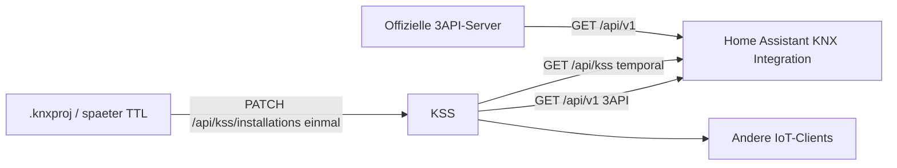

# HomeAssistant KNX Integration

Richtungsplan, **nicht jetzt implementieren.** Voraussetzung: Server-Seite aus [PATCH Installation exports](patch-installation-exports.md) (Installation → Location → Topology → Device → Datapoint → Trade), Vertrag [KSS and KNX 3rd Party API](kss-and-knx-3rd-party-api.md), Zeitmodell [Temporale Semantik](temporal-bus-semantics.md).

Einordnung und großes Ziel: [README](README.md).

## Problem

Home Assistant bezieht ETS-Semantik lokal: die KNX-Integration importiert eine `.knxproj` und parst sie mit xknxproject (`devTabSel/xknxproject`, `parse(combine=True)`). Jedes weitere Projekt wiederholt Import und Parse. Parser, Inferenz und Zeitmodell divergieren.

## Ziel

Der **KNX Semantic Server (KSS)** ist die zentrale Stelle: `.knxproj` (später TTL) wird **einmal** importiert. Die Home Assistant KNX Integration und andere IoT-Clients nutzen die geparsten, temporalen Daten und importieren nicht selbst.

KSS bleibt zur offiziellen KNX IoT 3rd Party API (`public-projects/knx-iot-3rd-party-api-schema`) kompatibel. HA kann Semantik vom KSS **oder** von einem beliebigen 3API-Server beziehen.

KSS kann als Home-Assistant-App (Add-on) laufen. Die KNX-Integration und andere Add-ons nutzen denselben Server — 3API-konform oder KSS-erweitert. Die KSS-Erweiterung historisiert Semantik (`last_modified`, BUS-Indizes).

## Heute

- HA-KNX-Integration: lokaler knxproj-Upload, Parser = xknxproject, Default `parse(combine=True)`.
- Der KSS-Fork bleibt kompatibel: ein `parse()`, Default unverändert. KSS ruft `parse(combine=False)`.
- Weitere IoT-Projekte wiederholen denselben Import oder bauen eigene Parser.

## KSS als Hub

- Ein Ingest: `PATCH /api/kss/installations` (Collection, Datei, Identität in `project_guid`).
- Viele Leser: GET auf denselben Bestand.
- Parser-Ort bleibt KSS (Fork `devTabSel/xknxproject`). Clients importieren nicht erneut.
- Semantik unter `/api/kss` temporal: ETS `last_modified`, Import-Uhr `last_import`, BUS `last_downloaded`. Neue Version nur bei relevanter Semantik, nicht bei bloßem LastModified.

## Zwei Client-Verträge

Dieselbe Installation, dieselbe UUID.

| Vertrag | Basis | Was der Client sieht |
| --- | --- | --- |
| 3API-konform | `/api/v1` | Nur Kategorie-1. Läuft gegen KSS **oder** ein offizielles KNXA-3API. Kein Ingest, keine Historie. |
| KSS-erweitert | `/api/kss` | Dieselben Pfade plus `kss:` (u. a. `kss:lastImport`, `kss:etsId`) und temporale Historie. Datei-Ingest nur hier. |

## Home Assistant langfristig

1. **Semantik-Quelle erweitern.** Nicht nur knxproj-Upload in der Integration, sondern GET gegen KSS (`/api/kss` wenn Historie nötig) oder gegen ein 3API (`/api/v1`).
2. **KSS als HA-App / Add-on.** Ein Server im HA-Host; Import einmal; die Integration liest nur.
3. **XKNX bleibt am Bus.** Runtime-Telegramme, Tunneling, Entities — nicht KSS. KSS liefert Semantik (Namen, Adressen, DPT, Locations, Geräte, Historie), nicht den Live-Wert. Telegramm-Auswertung später über BUS-Indizes.

Konkrete HA-PRs, Config-Flow und Auth gegen HA sind nicht Teil der aktuellen Schnitte.

## Weitere Clients

Visualisierung, Billing, FM, andere Smart-Home-Stacks: 3API wenn der kleinste Nenner reicht, `/api/kss` wenn Historie und ETS-Identität nötig sind.

## Abgrenzung

- Ändert weder HA-Core noch xknxproject-Upstream **jetzt**.
- Server-Umsetzung: PATCH Installation exports + KSS-Agent (Modellierer → APIler → Importer).
- TTL-Ingest später dieselbe `project_guid`; nicht über xknxproject.

## Nicht-Ziele

- OAuth / HA-Auth-Design
- Konkrete HA-PR-Schritte, YAML-Migration, Entity-Mapping
- Runtime-Telegramme und Bus-I/O (XKNX)
- Änderung des offiziellen 3API-JSON-Schemas
