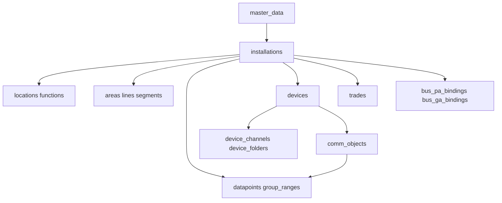

# KSS Modellierung (Feldlisten)

Kanonisch für **Modellierer**. Skill `knx-semantik`. **Jede Tabelle, jedes Feld.** Representer = Import/Fork; APIler = HTTP; Blubberer = Docs.

**Konflikt gelöst:** knx_master ist **global** `(MD-1, Version)` + `master_translations`. Nicht `(installation_id, ets_id)`.

Jedes `*_versions` und jede temporale Kante hat Mixin-`last_modified` (timestamptz NOT NULL, PK-Teil). Das Feld steht trotzdem an jeder Tabelle.

**Alembic `006_modellierung_feldlisten`** ausgeführt 2026-09-02 (upgrade + downgrade auf leerem Schema). Spalte **Ist** = was Modell + 006 getan haben, Zeitstempel `2026-09-02T21:47:01+02:00`. **Alembic `007_drop_inst_language_code`:** `installations.language_code` drop (Kategoriefehler: Parser-Overlay, nicht Identität/Version).

Legende: **persistieren** = Spalte bleibt / wird angelegt wie beschrieben. **anlegen** = fehlt im Ist. **drop** = Ist-Spalte weg. **ändern** = Nullability, Typ oder Tabelle wechselt.

## Tabellen

`installations`, `installation_versions`, `installation_subscriptions`, `master_data`, `master_translations`, `master_datapoint_types`, `master_datapoint_subtypes`, `datafields`, `master_function_types`, `master_datapoint_roles`, `master_space_usages`, `master_medium_types`, `master_function_points`, `master_manufacturers`, `master_project_types`, `locations`, `location_versions`, `functions`, `function_versions`, `function_datapoints`, `areas`, `area_versions`, `lines`, `line_versions`, `segments`, `segment_versions`, `group_ranges`, `group_range_versions`, `datapoints`, `datapoint_versions`, `devices`, `device_versions`, `device_channels`, `device_channel_versions`, `device_folders`, `device_folder_versions`, `comm_objects`, `comm_object_versions`, `comm_object_datapoints`, `trades`, `trade_versions`, `trade_devices`, `bus_pa_bindings`, `bus_ga_bindings`.

Nicht persistieren (keine Tabelle): `puid` überall; Site-Dummy; `prj:Site`; `core:Functionality`; `childLocations`/`locationDevices`/`locationFunctions` als Listen; Kind-Trades; `deviceDatapoints` auf Device; Runtime `value`/`timestamp`; LoadedImage/Checksums/APDU; MaskVersions; FunctionalBlocks; PDT; ProductLanguages-Tabelle; Signature; Scripts; MemberStatus; IP-Latenzen; BusAccess; Hashes; Traces; ToDos; LastUsedPuid; ArchivedVersion; xknxproject_version; Binaries. Hersteller-XML Hardware/Product/HP/ApplicationProgram: **offen**.

---

## Installation

`.ttl` und knxproj füllen dieselbe Identität. 3API hat `lastModified` und `state` — unter `/api/v1` ausgeben. Parser: `installation_index` hart 0 (Spalte entfällt); `ProjectStart` fehlt im Fork-ProjectInfo.

### `installations`

Unique `ets_id` global. Unique `project_guid` global.

| Feld | Soll | Ist-Delta | Ist |
| --- | --- | --- | --- |
| `id` | persistieren, UUID PK, 3API `data.id` | — | 2026-09-02T21:47:01+02:00 unverändert beibehalten |
| `ets_id` | persistieren, Text NOT NULL Unique (`P-040E-0`) | nullable → NOT NULL | 2026-09-02T21:47:01+02:00 NOT NULL gesetzt |
| `project_guid` | persistieren, UUID NOT NULL Unique | nullable → NOT NULL | 2026-09-02T21:47:01+02:00 NOT NULL gesetzt |
| `knx_project_id` | **drop** (im Prefix von `ets_id`) | drop | 2026-09-02T21:47:01+02:00 drop ausgeführt |
| `installation_index` | **drop** (im Suffix von `ets_id`) | drop | 2026-09-02T21:47:01+02:00 drop ausgeführt |
| `group_address_style` | **nicht auf Identität** (liegt auf Version) | Identität → Version | 2026-09-02T21:47:01+02:00 von Identität auf Version verschoben |
| `last_import` | persistieren, timestamptz NOT NULL, PATCH-Uhr; `/api/kss` `kss:lastImport` | — | 2026-09-02T21:47:01+02:00 unverändert beibehalten |
| `project_start` | **anlegen**, timestamptz nullable, Identität; PATCH überschreibt wenn eingehend nicht null | anlegen | 2026-09-02T21:47:01+02:00 Spalte angelegt |
| `language_code` | **drop** (Kategoriefehler: Parser-Overlay `XKNXProj(language=…)`, nicht knxproj/3API/ETS-Identität oder Version) | drop | 2026-09-02T22:06:48+02:00 drop ausgeführt |

### `installation_versions`

PK `(installation_id, last_modified)`. `/api/v1`: `lastModified`, `state`.

| Feld | Soll | Ist-Delta | Ist |
| --- | --- | --- | --- |
| `installation_id` | persistieren, UUID FK NOT NULL | — | 2026-09-02T21:47:01+02:00 unverändert beibehalten |
| `last_modified` | persistieren, timestamptz NOT NULL, PK; v1 = 3API `lastModified` | — | 2026-09-02T21:47:01+02:00 unverändert beibehalten |
| `title` | persistieren, Text NOT NULL (`ProjectInformation/@Name`, nicht `Installation/@Name`) | — | 2026-09-02T21:47:01+02:00 unverändert beibehalten |
| `comment` | persistieren, Text nullable (RTF erlaubt) | — | 2026-09-02T21:47:01+02:00 unverändert beibehalten |
| `contract_number` | persistieren, Text nullable | — | 2026-09-02T21:47:01+02:00 unverändert beibehalten |
| `project_installation_number` | persistieren, Text nullable (eine Spalte für 3API / `@ProjectNumber` / KIM) | — | 2026-09-02T21:47:01+02:00 unverändert beibehalten |
| `completion_status` | persistieren, Text nullable; v1 = 3API `state` | — | 2026-09-02T21:47:01+02:00 unverändert beibehalten |
| `type_description` | **drop** | drop | 2026-09-02T21:47:01+02:00 drop ausgeführt |
| `description` | **nicht anlegen** (3API Installation hat keins) | — | 2026-09-02T21:47:01+02:00 nicht anlegen — bestätigt |
| `at_type` | **nicht anlegen** | — | 2026-09-02T21:47:01+02:00 nicht anlegen — bestätigt |
| `project_type` | persistieren, Text nullable, XML-Token `ProjectType_t` | — | 2026-09-02T21:47:01+02:00 unverändert beibehalten |
| `master_data_version` | persistieren, Integer nullable (`MasterData/@Version`) | — | 2026-09-02T21:47:01+02:00 unverändert beibehalten |
| `schema_version` | **anlegen**, Text nullable, Namespace `project/23`, nicht `/api/v1` | anlegen | 2026-09-02T21:47:01+02:00 Spalte angelegt |
| `created_by` | **anlegen**, Text nullable, `KNX/@CreatedBy`, nicht `/api/v1` | anlegen | 2026-09-02T21:47:01+02:00 Spalte angelegt |
| `tool_version` | **anlegen**, Text nullable, `KNX/@ToolVersion`, nicht `/api/v1` | anlegen | 2026-09-02T21:47:01+02:00 Spalte angelegt |
| `ip_routing_backbone_key` | **anlegen**, Text nullable, `@IPRoutingBackboneKey`, nicht `/api/v1` | anlegen | 2026-09-02T21:47:01+02:00 Spalte angelegt |
| `bcu_key` | **anlegen**, Text nullable, `@BCUKey`, nicht `/api/v1` | anlegen | 2026-09-02T21:47:01+02:00 Spalte angelegt |
| `group_address_style` | persistieren, Text nullable (`ThreeLevel`/`TwoLevel`/`Free`); Anzeige der 16-Bit-GA | Identität → Version | 2026-09-02T21:47:01+02:00 von Identität auf Version verschoben |

Nicht persistieren: `Installation/@Name`; IP-Latenzen; BusAccess; Hashes; ProjectTraces; ToDos; LastUsedPuid; ArchivedVersion; xknxproject_version; Binaries; `prj:Site`.

### `installation_subscriptions`

Nicht historisiert. Unique `(installation_id, subscription_id)`.

| Feld | Soll | Ist-Delta | Ist |
| --- | --- | --- | --- |
| `id` | persistieren, **UUID PK** | BigInteger Identity → UUID | 2026-09-02T21:47:01+02:00 PK UUID, Identity drop |
| `installation_id` | persistieren, UUID FK NOT NULL | — | 2026-09-02T21:47:01+02:00 unverändert beibehalten |
| `subscription_id` | persistieren, UUID NOT NULL, kein FK bis Subscription-Paket | — | 2026-09-02T21:47:01+02:00 unverändert beibehalten |

---

## MasterData / datafields — übernommen 2026-09-02

Modul **`kss/models/master.py`**. Current-state, nicht temporal. Katalog aus `installation.py` raus. Zeiger bleibt `installation_versions.master_data_version`. Inline-`@Text`/`@Name` auf der Entity = Default **en-US**. Lookup: `master_translations[lang]` sonst Entity-Default.

### `master_data`

**anlegen.** Unique `(knx_id, version)`.

| Feld | Soll | Ist-Delta | Ist |
| --- | --- | --- | --- |
| `id` | UUID PK | anlegen | 2026-09-02T21:47:01+02:00 Tabelle/Spalte angelegt |
| `knx_id` | Text NOT NULL, `MasterData/@Id` (`MD-1`) | anlegen | 2026-09-02T21:47:01+02:00 Tabelle/Spalte angelegt |
| `version` | Integer NOT NULL, `MasterData/@Version` | anlegen | 2026-09-02T21:47:01+02:00 Tabelle/Spalte angelegt |

Kein `Signature`.

### `master_translations`

**anlegen.** Unique `(master_data_id, knx_id, language_code, attribute_name)`.

| Feld | Soll | Ist-Delta | Ist |
| --- | --- | --- | --- |
| `id` | UUID PK (surrogate, optional aber analog andere Kataloge) | anlegen | 2026-09-02T21:47:01+02:00 Tabelle/Spalte angelegt |
| `master_data_id` | UUID FK NOT NULL → `master_data.id` | anlegen | 2026-09-02T21:47:01+02:00 Tabelle/Spalte angelegt |
| `knx_id` | Text NOT NULL (RefId: `DPT-1`, `M-0083`, `FT-0`, `FP-1_DR-1`, `DPST-1-2_F-1`, …) | anlegen | 2026-09-02T21:47:01+02:00 Tabelle/Spalte angelegt |
| `language_code` | Text NOT NULL (`de-DE`, …) | anlegen | 2026-09-02T21:47:01+02:00 Tabelle/Spalte angelegt |
| `attribute_name` | Text NOT NULL (`Text`, `Name`, …) | anlegen | 2026-09-02T21:47:01+02:00 Tabelle/Spalte angelegt |
| `text` | Text NOT NULL | anlegen | 2026-09-02T21:47:01+02:00 Tabelle/Spalte angelegt |

Kein Duplikat von `en-US` in translations.

### `master_datapoint_types`

Unique `(master_data_id, knx_id)`.

| Feld | Soll | Ist-Delta | Ist |
| --- | --- | --- | --- |
| `id` | persistieren, UUID PK | — | 2026-09-02T21:47:01+02:00 unverändert beibehalten |
| `installation_id` | **drop** | drop | 2026-09-02T21:47:01+02:00 drop ausgeführt |
| `master_data_id` | **anlegen**, UUID FK NOT NULL | anlegen | 2026-09-02T21:47:01+02:00 Spalte angelegt |
| `knx_id` | persistieren, Text NOT NULL (`DPT-1`) | `ets_id` → `knx_id` | 2026-09-02T21:47:01+02:00 umbenannt ets_id → knx_id |
| `text` | persistieren, Text NOT NULL, Default `@Text` | Ist `name` splitten: `text` = `@Text` | 2026-09-02T21:47:01+02:00 name → text; code angelegt |
| `code` | **anlegen**, Text nullable, `@Name` (`1.xxx`) | anlegen | 2026-09-02T21:47:01+02:00 Spalte angelegt |
| `number` | **anlegen**, Integer nullable, `@Number` | anlegen | 2026-09-02T21:47:01+02:00 Spalte angelegt |
| `size_in_bit` | persistieren, Integer **NOT NULL** | nullable → NOT NULL | 2026-09-02T21:47:01+02:00 NOT NULL gesetzt |
| `name` | **drop** (ersetzt durch `text` + `code`) | drop nach Split | 2026-09-02T21:47:01+02:00 drop ausgeführt |
| `@PDT` | **nicht anlegen** | — | 2026-09-02T21:47:01+02:00 nicht anlegen — bestätigt |

### `master_datapoint_subtypes`

Unique `(master_data_id, knx_id)`.

| Feld | Soll | Ist-Delta | Ist |
| --- | --- | --- | --- |
| `id` | persistieren, UUID PK | — | 2026-09-02T21:47:01+02:00 unverändert beibehalten |
| `installation_id` | **drop** | drop | 2026-09-02T21:47:01+02:00 drop ausgeführt |
| `master_data_id` | **anlegen**, UUID FK NOT NULL | anlegen | 2026-09-02T21:47:01+02:00 Spalte angelegt |
| `knx_id` | persistieren, Text NOT NULL (`DPST-1-2`) | `ets_id` → `knx_id` | 2026-09-02T21:47:01+02:00 umbenannt ets_id → knx_id |
| `datapoint_type_knx_id` | persistieren, Text NOT NULL (`DPT-1`) | `datapoint_type_ets_id` umbenennen, NOT NULL | 2026-09-02T21:47:01+02:00 umbenannt, NOT NULL gesetzt |
| `text` | persistieren, Text nullable, Default `@Text` | Ist `name` → `text` | 2026-09-02T21:47:01+02:00 umbenannt name → text |
| `code` | **anlegen**, Text nullable, `@Name` (`DPT_Switch`) | anlegen | 2026-09-02T21:47:01+02:00 Spalte angelegt |
| `number` | **anlegen**, Integer nullable, `@Number` | anlegen | 2026-09-02T21:47:01+02:00 Spalte angelegt |
| `is_default` | **anlegen**, Boolean nullable, `@Default` | anlegen | 2026-09-02T21:47:01+02:00 Spalte angelegt |
| `name` | **drop** nach Split | drop | 2026-09-02T21:47:01+02:00 drop ausgeführt |

### `datafields`

Unique `(master_data_id, knx_id)`. 3API Format `DPST-1-2_F-1`. Runtime-`value` nicht persistieren.

| Feld | Soll | Ist-Delta | Ist |
| --- | --- | --- | --- |
| `id` | persistieren, UUID PK, stabil je `(master_data_id, knx_id)` | — | 2026-09-02T21:47:01+02:00 unverändert beibehalten |
| `installation_id` | **drop** | drop | 2026-09-02T21:47:01+02:00 drop ausgeführt |
| `master_data_id` | **anlegen**, UUID FK NOT NULL | anlegen | 2026-09-02T21:47:01+02:00 Spalte angelegt |
| `knx_id` | persistieren, Text NOT NULL | `ets_id` → `knx_id` | 2026-09-02T21:47:01+02:00 umbenannt ets_id → knx_id |
| `title` | persistieren, Text NOT NULL | — | 2026-09-02T21:47:01+02:00 unverändert beibehalten |
| `description` | persistieren, Text nullable | — | 2026-09-02T21:47:01+02:00 unverändert beibehalten |
| `datapoint_subtype_knx_id` | persistieren, Text nullable | `datapoint_subtype_ets_id` umbenennen | 2026-09-02T21:47:01+02:00 umbenannt …_ets_id → …_knx_id |
| `kind` | persistieren, Text nullable (`enum`/`numbered`/`datetime`/`string`) | — | 2026-09-02T21:47:01+02:00 unverändert beibehalten |
| `enum_value_map` | persistieren, JSONB nullable | — | 2026-09-02T21:47:01+02:00 unverändert beibehalten |
| `unit` | persistieren, Text nullable | — | 2026-09-02T21:47:01+02:00 unverändert beibehalten |
| `minimum` | persistieren, Numeric nullable | — | 2026-09-02T21:47:01+02:00 unverändert beibehalten |
| `maximum` | persistieren, Numeric nullable | — | 2026-09-02T21:47:01+02:00 unverändert beibehalten |
| `resolution` | persistieren, Numeric nullable | — | 2026-09-02T21:47:01+02:00 unverändert beibehalten |
| `integer` | persistieren, Boolean nullable | — | 2026-09-02T21:47:01+02:00 unverändert beibehalten |
| `charset` | persistieren, Text nullable | — | 2026-09-02T21:47:01+02:00 unverändert beibehalten |
| `max_length` | persistieren, Integer nullable | — | 2026-09-02T21:47:01+02:00 unverändert beibehalten |
| `value` | **nicht anlegen** | — | 2026-09-02T21:47:01+02:00 nicht anlegen — bestätigt |

### `master_function_types`

Unique `(master_data_id, knx_id)`.

| Feld | Soll | Ist-Delta | Ist |
| --- | --- | --- | --- |
| `id` | persistieren, UUID PK | — | 2026-09-02T21:47:01+02:00 unverändert beibehalten |
| `installation_id` | **drop** | drop | 2026-09-02T21:47:01+02:00 drop ausgeführt |
| `master_data_id` | **anlegen**, UUID FK NOT NULL | anlegen | 2026-09-02T21:47:01+02:00 Spalte angelegt |
| `knx_id` | persistieren, Text NOT NULL (`FT-0`) | `ets_id` → `knx_id` | 2026-09-02T21:47:01+02:00 umbenannt ets_id → knx_id |
| `number` | **anlegen**, Integer nullable | anlegen | 2026-09-02T21:47:01+02:00 Spalte angelegt |
| `text` | persistieren, Text nullable, `@Text` | Ist `name` → `text` | 2026-09-02T21:47:01+02:00 umbenannt name → text |
| `status` | **anlegen**, Text nullable (`deprecated` an FT-2) | anlegen | 2026-09-02T21:47:01+02:00 Spalte angelegt |
| `name` | **drop** nach Rename | drop | 2026-09-02T21:47:01+02:00 drop ausgeführt |

### `master_datapoint_roles`

Unique `(master_data_id, knx_id)`.

| Feld | Soll | Ist-Delta | Ist |
| --- | --- | --- | --- |
| `id` | persistieren, UUID PK | — | 2026-09-02T21:47:01+02:00 unverändert beibehalten |
| `installation_id` | **drop** | drop | 2026-09-02T21:47:01+02:00 drop ausgeführt |
| `master_data_id` | **anlegen**, UUID FK NOT NULL | anlegen | 2026-09-02T21:47:01+02:00 Spalte angelegt |
| `knx_id` | persistieren, Text NOT NULL (`DR-1`) | `ets_id` → `knx_id` | 2026-09-02T21:47:01+02:00 umbenannt ets_id → knx_id |
| `number` | **anlegen**, Integer nullable | anlegen | 2026-09-02T21:47:01+02:00 Spalte angelegt |
| `code` | persistieren, Text nullable, `@Name` (kein `@Text` in XML) | Ist `name` → `code` | 2026-09-02T21:47:01+02:00 umbenannt name → code |
| `name` | **drop** nach Rename | drop | 2026-09-02T21:47:01+02:00 drop ausgeführt |

### `master_space_usages`

Unique `(master_data_id, knx_id)`. Nur `SU-*`. Kein `tag:meetingRoom`.

| Feld | Soll | Ist-Delta | Ist |
| --- | --- | --- | --- |
| `id` | persistieren, UUID PK | — | 2026-09-02T21:47:01+02:00 unverändert beibehalten |
| `installation_id` | **drop** | drop | 2026-09-02T21:47:01+02:00 drop ausgeführt |
| `master_data_id` | **anlegen**, UUID FK NOT NULL | anlegen | 2026-09-02T21:47:01+02:00 Spalte angelegt |
| `knx_id` | persistieren, Text NOT NULL (`SU-12`) | `ets_id` → `knx_id` | 2026-09-02T21:47:01+02:00 umbenannt ets_id → knx_id |
| `number` | **anlegen**, Integer nullable | anlegen | 2026-09-02T21:47:01+02:00 Spalte angelegt |
| `text` | persistieren, Text nullable, `@Text` | Ist `name` → `text` | 2026-09-02T21:47:01+02:00 umbenannt name → text |
| `name` | **drop** nach Rename | drop | 2026-09-02T21:47:01+02:00 drop ausgeführt |

### `master_medium_types`

Unique `(master_data_id, knx_id)`.

| Feld | Soll | Ist-Delta | Ist |
| --- | --- | --- | --- |
| `id` | persistieren, UUID PK | — | 2026-09-02T21:47:01+02:00 unverändert beibehalten |
| `installation_id` | **drop** | drop | 2026-09-02T21:47:01+02:00 drop ausgeführt |
| `master_data_id` | **anlegen**, UUID FK NOT NULL | anlegen | 2026-09-02T21:47:01+02:00 Spalte angelegt |
| `knx_id` | persistieren, Text NOT NULL (`MT-0`) | `ets_id` → `knx_id` | 2026-09-02T21:47:01+02:00 umbenannt ets_id → knx_id |
| `number` | **anlegen**, Integer nullable | anlegen | 2026-09-02T21:47:01+02:00 Spalte angelegt |
| `code` | persistieren, Text nullable, `@Name` (TP) | aus Ist `name` splitten | 2026-09-02T21:47:01+02:00 name → code; text angelegt |
| `text` | persistieren, Text nullable, `@Text` | anlegen | 2026-09-02T21:47:01+02:00 Spalte angelegt |
| `domain_address_length` | **anlegen**, Integer nullable | anlegen | 2026-09-02T21:47:01+02:00 Spalte angelegt |
| `name` | **drop** nach Split | drop | 2026-09-02T21:47:01+02:00 drop ausgeführt |

### `master_function_points`

**anlegen.** Unique `(master_data_id, knx_id)` (`FP-1_DR-1`).

| Feld | Soll | Ist-Delta | Ist |
| --- | --- | --- | --- |
| `id` | UUID PK | anlegen | 2026-09-02T21:47:01+02:00 Tabelle/Spalte angelegt |
| `master_data_id` | UUID FK NOT NULL | anlegen | 2026-09-02T21:47:01+02:00 Tabelle/Spalte angelegt |
| `knx_id` | Text NOT NULL | anlegen | 2026-09-02T21:47:01+02:00 Tabelle/Spalte angelegt |
| `function_type_knx_id` | Text nullable | anlegen | 2026-09-02T21:47:01+02:00 Tabelle/Spalte angelegt |
| `role_knx_id` | Text nullable | anlegen | 2026-09-02T21:47:01+02:00 Tabelle/Spalte angelegt |
| `datapoint_subtype_knx_id` | Text nullable | anlegen | 2026-09-02T21:47:01+02:00 Tabelle/Spalte angelegt |
| `characteristics` | Text nullable | anlegen | 2026-09-02T21:47:01+02:00 Tabelle/Spalte angelegt |
| `text` | Text nullable, Default + translations | anlegen | 2026-09-02T21:47:01+02:00 Tabelle/Spalte angelegt |

### `master_manufacturers`

**anlegen** aus **knx_master Manufacturers only** (`M-0083`). Unique `(master_data_id, knx_id)`. Kein Script, kein MemberStatus/ImportRestriction. Nicht Hersteller-XML.

| Feld | Soll | Ist-Delta | Ist |
| --- | --- | --- | --- |
| `id` | UUID PK | anlegen | 2026-09-02T21:47:01+02:00 Tabelle/Spalte angelegt |
| `master_data_id` | UUID FK NOT NULL | anlegen | 2026-09-02T21:47:01+02:00 Tabelle/Spalte angelegt |
| `knx_id` | Text NOT NULL (`M-0083`) | anlegen | 2026-09-02T21:47:01+02:00 Tabelle/Spalte angelegt |
| `knx_manufacturer_id` | Integer/Text nullable, knx_master `@KnxManufacturerId` | anlegen | 2026-09-02T21:47:01+02:00 Tabelle/Spalte angelegt |
| `name` | Text nullable, Inline `@Name` | anlegen | 2026-09-02T21:47:01+02:00 Tabelle/Spalte angelegt |
| `default_language_code` | Text nullable (Produktdaten-Default, nicht Name-Locale) | anlegen | 2026-09-02T21:47:01+02:00 Tabelle/Spalte angelegt |

### `master_project_types`

Kein `master_data_id`. Unique `(ets_id, language_code)`. XSD-Token, Quelle ETS-UI, nicht knx_master.

| Feld | Soll | Ist-Delta | Ist |
| --- | --- | --- | --- |
| `id` | persistieren, UUID PK | — | 2026-09-02T21:47:01+02:00 unverändert beibehalten |
| `installation_id` | **drop** | drop | 2026-09-02T21:47:01+02:00 drop ausgeführt |
| `ets_id` | persistieren, Text NOT NULL (`Airport`) | Unique ohne `installation_id` | 2026-09-02T21:47:01+02:00 Unique (ets_id, language_code) |
| `language_code` | persistieren, Text NOT NULL | — | 2026-09-02T21:47:01+02:00 unverändert beibehalten |
| `name` | persistieren, Text NOT NULL | — | 2026-09-02T21:47:01+02:00 unverändert beibehalten |

Skip dieses Paket: MaskVersions, FunctionalBlocks, PDT, ProductLanguages-Tabelle, Scripts, CompatibilityGroup, ImportRestriction, MemberStatus, Signature, InterfaceObjectTypes/Properties. KIM-`tag:*`. KO-`FunctionText`.

---

## Location + Function

Namen sind keine Identität (test_A zwei „Raum 1“). Kein Site-Dummy. Trade-Tags nicht an Location/Function.

Parser (Representer): Space fehlt CompletionStatus, DefaultLine, Comment, LastModified; `space.devices` = Individualadresse, nicht `DI-n`. Function-TypedDict fehlt Description, Comment, LastModified.

### `locations`

Unique `(installation_id, ets_id)`.

| Feld | Soll | Ist-Delta | Ist |
| --- | --- | --- | --- |
| `id` | persistieren, UUID PK, 3API `data.id` | — | 2026-09-02T21:47:01+02:00 unverändert beibehalten |
| `installation_id` | persistieren, UUID FK NOT NULL | — | 2026-09-02T21:47:01+02:00 unverändert beibehalten |
| `ets_id` | persistieren, Text NOT NULL (`BP-n`) | nullable → NOT NULL | 2026-09-02T21:47:01+02:00 NOT NULL gesetzt |
| `puid` | **drop** | drop | 2026-09-02T21:47:01+02:00 drop ausgeführt |

### `location_versions`

PK `(location_id, last_modified)`. Nicht unter `/api/v1` als `lastModified`/`state`.

| Feld | Soll | Ist-Delta | Ist |
| --- | --- | --- | --- |
| `location_id` | persistieren, UUID FK NOT NULL | — | 2026-09-02T21:47:01+02:00 unverändert beibehalten |
| `last_modified` | persistieren, timestamptz NOT NULL, PK; nicht v1 | — | 2026-09-02T21:47:01+02:00 unverändert beibehalten |
| `title` | persistieren, Text NOT NULL | — | 2026-09-02T21:47:01+02:00 unverändert beibehalten |
| `description` | persistieren, Text nullable | — | 2026-09-02T21:47:01+02:00 unverändert beibehalten |
| `comment` | persistieren, Text nullable | — | 2026-09-02T21:47:01+02:00 unverändert beibehalten |
| `number` | persistieren, Text nullable, `@Number` | — | 2026-09-02T21:47:01+02:00 unverändert beibehalten |
| `location_type` | persistieren, Text nullable, XML-Token `SpaceType_t` | — | 2026-09-02T21:47:01+02:00 unverändert beibehalten |
| `usage` | persistieren, Text nullable, Token `tag:` / `SU-*` (kein `usage_text`) | — | 2026-09-02T21:47:01+02:00 unverändert beibehalten |
| `completion_status` | persistieren, Text nullable; nicht v1-`state` | — | 2026-09-02T21:47:01+02:00 unverändert beibehalten |
| `at_type` | persistieren, ARRAY Text nullable | — | 2026-09-02T21:47:01+02:00 unverändert beibehalten |
| `type_description` | **drop** | drop | 2026-09-02T21:47:01+02:00 drop ausgeführt |
| `parent_location_id` | persistieren, UUID FK nullable = Wurzel | — | 2026-09-02T21:47:01+02:00 unverändert beibehalten |
| `default_line_id` | persistieren, UUID FK `lines.id` nullable | — | 2026-09-02T21:47:01+02:00 unverändert beibehalten |

Nicht speichern: `childLocations`, `locationDevices` (→ Device.`location_id`), `locationFunctions` (→ Function.`location_id`), `usage_text`, `prj:Site`.

### `functions`

Unique `(installation_id, ets_id)`.

| Feld | Soll | Ist-Delta | Ist |
| --- | --- | --- | --- |
| `id` | persistieren, UUID PK, 3API `data.id` | — | 2026-09-02T21:47:01+02:00 unverändert beibehalten |
| `installation_id` | persistieren, UUID FK NOT NULL | — | 2026-09-02T21:47:01+02:00 unverändert beibehalten |
| `ets_id` | persistieren, Text NOT NULL (`F-n`) | nullable → NOT NULL | 2026-09-02T21:47:01+02:00 NOT NULL gesetzt |
| `puid` | **drop** | drop | 2026-09-02T21:47:01+02:00 drop ausgeführt |

### `function_versions`

PK `(function_id, last_modified)`. Nicht unter v1.

| Feld | Soll | Ist-Delta | Ist |
| --- | --- | --- | --- |
| `function_id` | persistieren, UUID FK NOT NULL | — | 2026-09-02T21:47:01+02:00 unverändert beibehalten |
| `last_modified` | persistieren, timestamptz NOT NULL, PK; nicht v1 | — | 2026-09-02T21:47:01+02:00 unverändert beibehalten |
| `title` | persistieren, Text NOT NULL | — | 2026-09-02T21:47:01+02:00 unverändert beibehalten |
| `description` | persistieren, Text nullable | — | 2026-09-02T21:47:01+02:00 unverändert beibehalten |
| `comment` | persistieren, Text nullable | — | 2026-09-02T21:47:01+02:00 unverändert beibehalten |
| `function_type_ets_id` | persistieren, Text **NOT NULL** (`FT-*` / `FT-0`) | nullable → NOT NULL | 2026-09-02T21:47:01+02:00 NOT NULL gesetzt |
| `at_type` | persistieren, ARRAY Text nullable | — | 2026-09-02T21:47:01+02:00 unverändert beibehalten |
| `type_description` | **drop** | drop | 2026-09-02T21:47:01+02:00 drop ausgeführt |
| `location_id` | persistieren, UUID FK nullable | — | 2026-09-02T21:47:01+02:00 unverändert beibehalten |
| `completion_status` | **anlegen**, Text nullable; nicht v1-`state` | anlegen | 2026-09-02T21:47:01+02:00 Spalte angelegt |

Nicht persistieren: `core:Functionality`.

### `function_datapoints`

PK `(function_id, datapoint_id, last_modified)`.

| Feld | Soll | Ist-Delta | Ist |
| --- | --- | --- | --- |
| `function_id` | persistieren, UUID FK NOT NULL | — | 2026-09-02T21:47:01+02:00 unverändert beibehalten |
| `datapoint_id` | persistieren, UUID FK `datapoints.id` NOT NULL | — | 2026-09-02T21:47:01+02:00 unverändert beibehalten |
| `last_modified` | persistieren, timestamptz NOT NULL, PK-Teil | — | 2026-09-02T21:47:01+02:00 unverändert beibehalten |
| `ets_id` | persistieren, Text nullable (`GF-n`, nur knxproj) | — | 2026-09-02T21:47:01+02:00 unverändert beibehalten |
| `role` | persistieren, Text nullable (`DR-*` oder UUID) | — | 2026-09-02T21:47:01+02:00 unverändert beibehalten |
| `linked` | persistieren, Boolean NOT NULL (`false` = Unlink) | — | 2026-09-02T21:47:01+02:00 unverändert beibehalten |

---

## Topology (nur knxproj)

`.ttl` schreibt keine Area/Line/Segment-Zeilen. Unique je `(installation_id, ets_id)`. last_modified nicht unter v1. IA am Device bleibt TTL-Quelle für Area/Line-Ziffern zur Laufzeit.

### `areas`

| Feld | Soll | Ist-Delta | Ist |
| --- | --- | --- | --- |
| `id` | persistieren, UUID PK | — | 2026-09-02T21:47:01+02:00 unverändert beibehalten |
| `installation_id` | persistieren, UUID FK NOT NULL | — | 2026-09-02T21:47:01+02:00 unverändert beibehalten |
| `ets_id` | persistieren, Text NOT NULL (`A-n`, nicht aus IA ableiten) | — | 2026-09-02T21:47:01+02:00 unverändert beibehalten |
| `puid` | **drop** | drop | 2026-09-02T21:47:01+02:00 drop ausgeführt |

### `area_versions`

PK `(area_id, last_modified)`.

| Feld | Soll | Ist-Delta | Ist |
| --- | --- | --- | --- |
| `area_id` | persistieren, UUID FK NOT NULL | — | 2026-09-02T21:47:01+02:00 unverändert beibehalten |
| `last_modified` | persistieren, timestamptz NOT NULL, PK; nicht v1 | — | 2026-09-02T21:47:01+02:00 unverändert beibehalten |
| `name` | persistieren, Text nullable | — | 2026-09-02T21:47:01+02:00 unverändert beibehalten |
| `address` | persistieren, Integer **NOT NULL** 0–15, `@Address`, unabhängig von `ets_id` | nullable → NOT NULL | 2026-09-02T21:47:01+02:00 NOT NULL gesetzt |
| `description` | **anlegen**, Text nullable, `@Description` | anlegen | 2026-09-02T21:47:01+02:00 Spalte angelegt |
| `completion_status` | **anlegen**, Text nullable; nicht v1 | anlegen | 2026-09-02T21:47:01+02:00 Spalte angelegt |

### `lines`

| Feld | Soll | Ist-Delta | Ist |
| --- | --- | --- | --- |
| `id` | persistieren, UUID PK | — | 2026-09-02T21:47:01+02:00 unverändert beibehalten |
| `installation_id` | persistieren, UUID FK NOT NULL | — | 2026-09-02T21:47:01+02:00 unverändert beibehalten |
| `ets_id` | persistieren, Text NOT NULL (`L-n`) | — | 2026-09-02T21:47:01+02:00 unverändert beibehalten |
| `puid` | **drop** | drop | 2026-09-02T21:47:01+02:00 drop ausgeführt |
| `area_id` | **von Identität auf `line_versions`** | drop auf Identity | 2026-09-02T21:47:01+02:00 auf Identität drop, auf Version gelegt |

### `line_versions`

PK `(line_id, last_modified)`.

| Feld | Soll | Ist-Delta | Ist |
| --- | --- | --- | --- |
| `line_id` | persistieren, UUID FK NOT NULL | — | 2026-09-02T21:47:01+02:00 unverändert beibehalten |
| `last_modified` | persistieren, timestamptz NOT NULL, PK; nicht v1 | — | 2026-09-02T21:47:01+02:00 unverändert beibehalten |
| `name` | persistieren, Text nullable | — | 2026-09-02T21:47:01+02:00 unverändert beibehalten |
| `address` | persistieren, Integer **NOT NULL** 0–15 | nullable → NOT NULL | 2026-09-02T21:47:01+02:00 NOT NULL gesetzt |
| `area_id` | persistieren, UUID FK `areas.id` **NOT NULL** | von Identity hierher | 2026-09-02T21:47:01+02:00 von Identität auf Version kopiert |
| `medium_type_ets_id` | persistieren, Text nullable (`MT-*`) | — | 2026-09-02T21:47:01+02:00 unverändert beibehalten |
| `description` | **anlegen**, Text nullable | anlegen | 2026-09-02T21:47:01+02:00 Spalte angelegt |
| `completion_status` | **anlegen**, Text nullable | anlegen | 2026-09-02T21:47:01+02:00 Spalte angelegt |

### `segments`

| Feld | Soll | Ist-Delta | Ist |
| --- | --- | --- | --- |
| `id` | persistieren, UUID PK | — | 2026-09-02T21:47:01+02:00 unverändert beibehalten |
| `installation_id` | persistieren, UUID FK NOT NULL | — | 2026-09-02T21:47:01+02:00 unverändert beibehalten |
| `ets_id` | persistieren, Text NOT NULL (`S-n`) | — | 2026-09-02T21:47:01+02:00 unverändert beibehalten |
| `puid` | **drop** | drop | 2026-09-02T21:47:01+02:00 drop ausgeführt |
| `line_id` | **von Identität auf `segment_versions`** | drop auf Identity | 2026-09-02T21:47:01+02:00 auf Identität drop, auf Version gelegt |

### `segment_versions`

PK `(segment_id, last_modified)`.

| Feld | Soll | Ist-Delta | Ist |
| --- | --- | --- | --- |
| `segment_id` | persistieren, UUID FK NOT NULL | — | 2026-09-02T21:47:01+02:00 unverändert beibehalten |
| `last_modified` | persistieren, timestamptz NOT NULL, PK; nicht v1 | — | 2026-09-02T21:47:01+02:00 unverändert beibehalten |
| `name` | persistieren, Text nullable | — | 2026-09-02T21:47:01+02:00 unverändert beibehalten |
| `medium_type_ets_id` | persistieren, Text nullable (`MT-*`) | — | 2026-09-02T21:47:01+02:00 unverändert beibehalten |
| `line_id` | persistieren, UUID FK `lines.id` **NOT NULL** | von Identity hierher | 2026-09-02T21:47:01+02:00 von Identität auf Version kopiert |
| `number` | **anlegen**, Text/Integer nullable, `@Number` | anlegen | 2026-09-02T21:47:01+02:00 Spalte angelegt |
| `description` | **anlegen**, Text nullable | anlegen | 2026-09-02T21:47:01+02:00 Spalte angelegt |
| `completion_status` | **anlegen**, Text nullable | anlegen | 2026-09-02T21:47:01+02:00 Spalte angelegt |

---

## Datapoint + GroupRange

Datapoint = 3API datapoint = GA = `knx:FunctionPoint`. CommObject ist **nicht** dieser Datapoint. Enum/Unit/Min/Max auf `datafields`.

### `group_ranges`

Nur knxproj. Unique `(installation_id, ets_id)`. `.ttl` füllt keine Zeilen.

| Feld | Soll | Ist-Delta | Ist |
| --- | --- | --- | --- |
| `id` | persistieren, UUID PK | — | 2026-09-02T21:47:01+02:00 unverändert beibehalten |
| `installation_id` | persistieren, UUID FK NOT NULL | — | 2026-09-02T21:47:01+02:00 unverändert beibehalten |
| `ets_id` | persistieren, Text NOT NULL (`GR-n`) | — | 2026-09-02T21:47:01+02:00 unverändert beibehalten |
| `puid` | **drop** | drop | 2026-09-02T21:47:01+02:00 drop ausgeführt |

### `group_range_versions`

PK `(group_range_id, last_modified)`. Nicht unter v1. Keine weiteren Rest-XML-Attribute.

| Feld | Soll | Ist-Delta | Ist |
| --- | --- | --- | --- |
| `group_range_id` | persistieren, UUID FK NOT NULL | — | 2026-09-02T21:47:01+02:00 unverändert beibehalten |
| `last_modified` | persistieren, timestamptz NOT NULL, PK; nicht v1 | — | 2026-09-02T21:47:01+02:00 unverändert beibehalten |
| `name` | persistieren, Text nullable | — | 2026-09-02T21:47:01+02:00 unverändert beibehalten |
| `comment` | persistieren, Text nullable | — | 2026-09-02T21:47:01+02:00 unverändert beibehalten |
| `description` | persistieren, Text nullable | — | 2026-09-02T21:47:01+02:00 unverändert beibehalten |
| `parent_group_range_id` | persistieren, UUID FK nullable = Wurzel | — | 2026-09-02T21:47:01+02:00 unverändert beibehalten |
| `range_start` | persistieren, Integer nullable 0–65535 | — | 2026-09-02T21:47:01+02:00 unverändert beibehalten |
| `range_end` | persistieren, Integer nullable 0–65535 | — | 2026-09-02T21:47:01+02:00 unverändert beibehalten |
| `unfiltered` | **anlegen**, Boolean nullable, `@Unfiltered` | anlegen | 2026-09-02T21:47:01+02:00 Spalte angelegt |
| `completion_status` | **anlegen**, Text nullable; nicht v1 | anlegen | 2026-09-02T21:47:01+02:00 Spalte angelegt |
| `security` | **anlegen**, Text nullable, `@Security` | anlegen | 2026-09-02T21:47:01+02:00 Spalte angelegt |

### `datapoints`

Unique `(installation_id, ets_id)`. knxproj `GA-n` = TTL `prj:GA-n`.

| Feld | Soll | Ist-Delta | Ist |
| --- | --- | --- | --- |
| `id` | persistieren, UUID PK, 3API `data.id` | — | 2026-09-02T21:47:01+02:00 unverändert beibehalten |
| `installation_id` | persistieren, UUID FK NOT NULL | — | 2026-09-02T21:47:01+02:00 unverändert beibehalten |
| `ets_id` | persistieren, Text NOT NULL | nullable → NOT NULL | 2026-09-02T21:47:01+02:00 NOT NULL gesetzt |
| `puid` | **drop** | drop | 2026-09-02T21:47:01+02:00 drop ausgeführt |
| `group_range_id` | **nicht auf Identität** (liegt auf Version) | Ist bereits auf Version | 2026-09-02T21:47:01+02:00 bestätigt, nicht auf Identität |

### `datapoint_versions`

PK `(datapoint_id, last_modified)`. **Nicht** unter `/api/v1` als `lastModified`.

| Feld | Soll | Ist-Delta | Ist |
| --- | --- | --- | --- |
| `datapoint_id` | persistieren, UUID FK NOT NULL | — | 2026-09-02T21:47:01+02:00 unverändert beibehalten |
| `last_modified` | persistieren, timestamptz NOT NULL, PK; nicht v1 | — | 2026-09-02T21:47:01+02:00 unverändert beibehalten |
| `name` | persistieren, Text nullable; v1 = 3API `title` | Ist `title` NOT NULL → `name` nullable (Rename) | 2026-09-02T21:47:01+02:00 umbenannt title → name, nullable |
| `description` | persistieren, Text nullable | — | 2026-09-02T21:47:01+02:00 unverändert beibehalten |
| `comment` | persistieren, Text nullable | — | 2026-09-02T21:47:01+02:00 unverändert beibehalten |
| `group_address` | persistieren, Integer nullable **0–65535**; 16-Bit `@Address` / `knx:groupAddress`; Anzeige aus Stil + Integer, keine Haupt-/Mittelgruppe-Spalten | Integer beibehalten | 2026-09-02T21:47:01+02:00 Integer 0–65535 beibehalten |
| `datapoint_subtype_ets_id` | persistieren, Text nullable, Token `DPST-x-y` / `DPT-x` | — | 2026-09-02T21:47:01+02:00 unverändert beibehalten |
| `datapoint_type` | **drop** (kein Array) | drop ARRAY | 2026-09-02T21:47:01+02:00 ARRAY-Spalte drop |
| `readable` | persistieren, Boolean nullable | — | 2026-09-02T21:47:01+02:00 unverändert beibehalten |
| `writable` | persistieren, Boolean nullable | — | 2026-09-02T21:47:01+02:00 unverändert beibehalten |
| `security` | persistieren, Text nullable | — | 2026-09-02T21:47:01+02:00 unverändert beibehalten |
| `group_range_id` | persistieren, UUID FK nullable (von Identity hierher, Ist schon hier) | — | 2026-09-02T21:47:01+02:00 unverändert beibehalten |
| `purpose` | persistieren, Text nullable | anlegen (fehlt im Ist) | 2026-09-02T21:47:01+02:00 Spalte angelegt |
| `unfiltered` | persistieren, Boolean nullable | anlegen | 2026-09-02T21:47:01+02:00 Spalte angelegt |
| `central` | persistieren, Boolean nullable | anlegen | 2026-09-02T21:47:01+02:00 Spalte angelegt |
| `completion_status` | **anlegen**, Text nullable; nicht v1 | anlegen | 2026-09-02T21:47:01+02:00 Spalte angelegt |
| `global` | **anlegen**, Boolean nullable, `@Global` | anlegen | 2026-09-02T21:47:01+02:00 Spalte angelegt |
| `key` | **anlegen**, Text nullable, XML `@Key` / Data Secure Gruppenkey | anlegen | 2026-09-02T21:47:01+02:00 Spalte angelegt |
| `value` | **nicht persistieren** | — | 2026-09-02T21:47:01+02:00 nicht anlegen — bestätigt |
| `timestamp` | **nicht persistieren** | — | 2026-09-02T21:47:01+02:00 nicht anlegen — bestätigt |

---

## Device

knxproj + TTL = dieselbe `DI-n`. Paket umfasst Device, Channel, Folder, CommObject. BUS nicht in diesem Paket. `deviceDatapoints` nicht auf Device.

Parser Device-TypedDict (Representer): fehlt u. a. `DI-n`, Comment, Serial, LastModified/LastDownload, `*Loaded`, ProductRef, InstallationHints, CompletionStatus, Location, Segment, AssignedTrade-Name, ChannelInstance-`@RefId`. Folders/Trades fehlen ganz. `project_uid` nicht persistieren.

### `devices`

Unique `(installation_id, ets_id)`.

| Feld | Soll | Ist-Delta | Ist |
| --- | --- | --- | --- |
| `id` | persistieren, UUID PK, 3API `data.id` | — | 2026-09-02T21:47:01+02:00 unverändert beibehalten |
| `installation_id` | persistieren, UUID FK NOT NULL | — | 2026-09-02T21:47:01+02:00 unverändert beibehalten |
| `ets_id` | persistieren, Text NOT NULL (`DI-n` / `prj:DI-n`) | nullable → NOT NULL | 2026-09-02T21:47:01+02:00 NOT NULL gesetzt |
| `puid` | **drop** | drop | 2026-09-02T21:47:01+02:00 drop ausgeführt |

### `device_versions`

PK `(device_id, last_modified)`. `/api/v1`: `lastModified`, `lastDownloaded`. **Nicht** v1-`state`.

| Feld | Soll | Ist-Delta | Ist |
| --- | --- | --- | --- |
| `device_id` | persistieren, UUID FK NOT NULL | — | 2026-09-02T21:47:01+02:00 unverändert beibehalten |
| `last_modified` | persistieren, timestamptz NOT NULL, PK; **unter v1** | — | 2026-09-02T21:47:01+02:00 unverändert beibehalten |
| `title` | persistieren, Text NOT NULL (`@Name` sonst Produktname) | — | 2026-09-02T21:47:01+02:00 unverändert beibehalten |
| `description` | persistieren, Text nullable | — | 2026-09-02T21:47:01+02:00 unverändert beibehalten |
| `comment` | persistieren, Text nullable | — | 2026-09-02T21:47:01+02:00 unverändert beibehalten |
| `order_number` | persistieren, Text nullable | — | 2026-09-02T21:47:01+02:00 unverändert beibehalten |
| `manufacturer` | persistieren, Text nullable | — | 2026-09-02T21:47:01+02:00 unverändert beibehalten |
| `last_downloaded` | persistieren, timestamptz nullable; Sentinel nie speichern; v1 = `lastDownloaded` | — | 2026-09-02T21:47:01+02:00 unverändert beibehalten |
| `current_date_time` | **drop** | drop | 2026-09-02T21:47:01+02:00 drop ausgeführt |
| `serial_number` | persistieren, Text nullable, eine Hex-Spalte | — | 2026-09-02T21:47:01+02:00 unverändert beibehalten |
| `individual_address` | persistieren, Text nullable, 3API-Punktnotation (TTL-Hex wandeln) | — | 2026-09-02T21:47:01+02:00 unverändert beibehalten |
| `firmware_version` | persistieren, Text nullable | — | 2026-09-02T21:47:01+02:00 unverändert beibehalten |
| `hardware_version` | persistieren, Text nullable | — | 2026-09-02T21:47:01+02:00 unverändert beibehalten |
| `completion_status` | persistieren, Text nullable; nicht v1-`state` | — | 2026-09-02T21:47:01+02:00 unverändert beibehalten |
| `communication_part_loaded` | persistieren, Boolean nullable | — | 2026-09-02T21:47:01+02:00 unverändert beibehalten |
| `individual_address_loaded` | persistieren, Boolean nullable | — | 2026-09-02T21:47:01+02:00 unverändert beibehalten |
| `application_program_loaded` | persistieren, Boolean nullable | — | 2026-09-02T21:47:01+02:00 unverändert beibehalten |
| `parameters_loaded` | persistieren, Boolean nullable | — | 2026-09-02T21:47:01+02:00 unverändert beibehalten |
| `medium_config_loaded` | persistieren, Boolean nullable | — | 2026-09-02T21:47:01+02:00 unverändert beibehalten |
| `product_ref` | persistieren, Text nullable, `@ProductRefId` | — | 2026-09-02T21:47:01+02:00 unverändert beibehalten |
| `application_program_ref` | persistieren, Text nullable (XML `Hardware2ProgramRefId`) | — | 2026-09-02T21:47:01+02:00 unverändert beibehalten |
| `bus_current` | persistieren, Integer nullable | — | 2026-09-02T21:47:01+02:00 unverändert beibehalten |
| `installation_hints` | persistieren, Text nullable | — | 2026-09-02T21:47:01+02:00 unverändert beibehalten |
| `at_type` | persistieren, ARRAY Text nullable | — | 2026-09-02T21:47:01+02:00 unverändert beibehalten |
| `type_description` | **drop** | drop | 2026-09-02T21:47:01+02:00 drop ausgeführt |
| `location_id` | persistieren, UUID FK nullable | — | 2026-09-02T21:47:01+02:00 unverändert beibehalten |
| `segment_id` | persistieren, UUID FK `segments.id` nullable | — | 2026-09-02T21:47:01+02:00 unverändert beibehalten |
| `assigned_trade` | **anlegen**, Text nullable: TTL `mac:assignedTrade`; knxproj = `Trade/@Name` (kein FK) | anlegen | 2026-09-02T21:47:01+02:00 Spalte angelegt |
| `operates_for_trade` | **anlegen**, ARRAY Text nullable, `tag:`-Tokens, nur TTL | anlegen | 2026-09-02T21:47:01+02:00 Spalte angelegt |

Nicht persistieren: LoadedImage, CheckSums, APDU-Zähler.

---

## Channel

Unique **`(device_id, ets_id)`**. last_modified nicht unter v1. Leere Kanäle zulässig. ChannelInstance und Tree-Node mit gleichem `@RefId` = eine Zeile.

### `device_channels`

| Feld | Soll | Ist-Delta | Ist |
| --- | --- | --- | --- |
| `id` | persistieren, UUID PK | — | 2026-09-02T21:47:01+02:00 unverändert beibehalten |
| `device_id` | persistieren, UUID FK NOT NULL | — | 2026-09-02T21:47:01+02:00 unverändert beibehalten |
| `ets_id` | persistieren, Text NOT NULL. Mit ChannelInstance: `@Id` ohne XML-Präfix (`DI-n_CI-n`). Ohne: GOT Node `@RefId` (`CH-Basic`, …) — nicht TTL-`CI-n`-Index. | — | 2026-09-02T21:47:01+02:00 unverändert beibehalten |

### `device_channel_versions`

PK `(channel_id, last_modified)`.

| Feld | Soll | Ist-Delta | Ist |
| --- | --- | --- | --- |
| `channel_id` | persistieren, UUID FK NOT NULL | — | 2026-09-02T21:47:01+02:00 unverändert beibehalten |
| `last_modified` | persistieren, timestamptz NOT NULL, PK; nicht v1 | — | 2026-09-02T21:47:01+02:00 unverändert beibehalten |
| `title` | persistieren, Text nullable | — | 2026-09-02T21:47:01+02:00 unverändert beibehalten |
| `description` | persistieren, Text nullable, `ChannelInstance/@Description` (GOT-only NULL) | — | 2026-09-02T21:47:01+02:00 unverändert beibehalten |
| `catalog_ref` | persistieren, Text nullable, `@RefId` | — | 2026-09-02T21:47:01+02:00 unverändert beibehalten |
| `parent_channel_id` | persistieren, UUID FK nullable (Channel unter Channel; NULL = Parent Device) | — | 2026-09-02T21:47:01+02:00 unverändert beibehalten |

---

## Folder (nur knxproj)

Unique `(device_id, ets_id)`. `.ttl` schreibt keine Folder-Zeilen. last_modified nicht unter v1. Tabelle **behalten**.

### `device_folders`

| Feld | Soll | Ist-Delta | Ist |
| --- | --- | --- | --- |
| `id` | persistieren, UUID PK | — | 2026-09-02T21:47:01+02:00 unverändert beibehalten |
| `device_id` | persistieren, UUID FK NOT NULL | — | 2026-09-02T21:47:01+02:00 unverändert beibehalten |
| `ets_id` | persistieren, Text NOT NULL (`PB-*`) | — | 2026-09-02T21:47:01+02:00 unverändert beibehalten |

### `device_folder_versions`

PK `(folder_id, last_modified)`. Check: `parent_folder_id` XOR `parent_channel_id` (nicht beide gesetzt). Beide NULL = Parent Device.

| Feld | Soll | Ist-Delta | Ist |
| --- | --- | --- | --- |
| `folder_id` | persistieren, UUID FK NOT NULL | — | 2026-09-02T21:47:01+02:00 unverändert beibehalten |
| `last_modified` | persistieren, timestamptz NOT NULL, PK; nicht v1 | — | 2026-09-02T21:47:01+02:00 unverändert beibehalten |
| `title` | persistieren, Text nullable | — | 2026-09-02T21:47:01+02:00 unverändert beibehalten |
| `parent_folder_id` | persistieren, UUID FK nullable | — | 2026-09-02T21:47:01+02:00 unverändert beibehalten |
| `parent_channel_id` | persistieren, UUID FK `device_channels.id` nullable | — | 2026-09-02T21:47:01+02:00 unverändert beibehalten |

---

## CommObject

Nicht der 3API-Datapoint. TTL `core:Datapoint` am KO, Join `O-…_R-…`. Unique **`(device_id, ets_id)`**. last_modified nicht unter v1. FunctionText-Sprache: Hersteller-XML, nicht knx_master. Zweites Feld `function_text` vs. `text`: **offen**, kein zweites Feld ohne Abstimmung.

### `comm_objects`

| Feld | Soll | Ist-Delta | Ist |
| --- | --- | --- | --- |
| `id` | persistieren, UUID PK | — | 2026-09-02T21:47:01+02:00 unverändert beibehalten |
| `device_id` | persistieren, UUID FK NOT NULL | — | 2026-09-02T21:47:01+02:00 unverändert beibehalten |
| `ets_id` | persistieren, Text NOT NULL (`O-…_R-…`) | — | 2026-09-02T21:47:01+02:00 unverändert beibehalten |
| `channel_id` | **von Identität auf `comm_object_versions`** | drop auf Identity | 2026-09-02T21:47:01+02:00 auf Identität drop, auf Version gelegt |
| `folder_id` | **von Identität auf `comm_object_versions`** | drop auf Identity | 2026-09-02T21:47:01+02:00 auf Identität drop, auf Version gelegt |

### `comm_object_versions`

PK `(comm_object_id, last_modified)`.

| Feld | Soll | Ist-Delta | Ist |
| --- | --- | --- | --- |
| `comm_object_id` | persistieren, UUID FK NOT NULL | — | 2026-09-02T21:47:01+02:00 unverändert beibehalten |
| `last_modified` | persistieren, timestamptz NOT NULL, PK; nicht v1 | — | 2026-09-02T21:47:01+02:00 unverändert beibehalten |
| `number` | persistieren, Integer nullable | — | 2026-09-02T21:47:01+02:00 unverändert beibehalten |
| `name` | persistieren, Text nullable, KO-Name | — | 2026-09-02T21:47:01+02:00 unverändert beibehalten |
| `text` | persistieren, Text nullable, Funktions-Text | — | 2026-09-02T21:47:01+02:00 unverändert beibehalten |
| `datapoint_subtype_ets_id` | persistieren, Text nullable (`DPST-*`) | — | 2026-09-02T21:47:01+02:00 unverändert beibehalten |
| `communication_flag` | persistieren, Boolean nullable | — | 2026-09-02T21:47:01+02:00 unverändert beibehalten |
| `read_flag` | persistieren, Boolean nullable | — | 2026-09-02T21:47:01+02:00 unverändert beibehalten |
| `write_flag` | persistieren, Boolean nullable | — | 2026-09-02T21:47:01+02:00 unverändert beibehalten |
| `transmit_flag` | persistieren, Boolean nullable | — | 2026-09-02T21:47:01+02:00 unverändert beibehalten |
| `update_flag` | persistieren, Boolean nullable | — | 2026-09-02T21:47:01+02:00 unverändert beibehalten |
| `read_on_init_flag` | persistieren, Boolean nullable | — | 2026-09-02T21:47:01+02:00 unverändert beibehalten |
| `priority` | persistieren, Text nullable | — | 2026-09-02T21:47:01+02:00 unverändert beibehalten |
| `channel_id` | persistieren, UUID FK nullable (von Identität) | anlegen auf Version | 2026-09-02T21:47:01+02:00 auf Version angelegt |
| `folder_id` | persistieren, UUID FK nullable (von Identität) | anlegen auf Version | 2026-09-02T21:47:01+02:00 auf Version angelegt |

### `comm_object_datapoints`

PK `(comm_object_id, datapoint_id, last_modified)`. Quelle: `ComObjectInstanceRef/@Links` / TTL `core:groups`.

| Feld | Soll | Ist-Delta | Ist |
| --- | --- | --- | --- |
| `comm_object_id` | persistieren, UUID FK NOT NULL | — | 2026-09-02T21:47:01+02:00 unverändert beibehalten |
| `datapoint_id` | persistieren, UUID FK `datapoints.id` NOT NULL | — | 2026-09-02T21:47:01+02:00 unverändert beibehalten |
| `last_modified` | persistieren, timestamptz NOT NULL, PK-Teil | — | 2026-09-02T21:47:01+02:00 unverändert beibehalten |
| `linked` | persistieren, Boolean NOT NULL (`false` = Unlink) | — | 2026-09-02T21:47:01+02:00 unverändert beibehalten |

---

## Trade (nur knxproj)

Alles Kategorie 3. Kein `/api/v1`-Trade-Item. `.ttl` schreibt **keine** Zeilen in diese drei Tabellen. Parser `trades` fehlt in xknxproject.

### `trades`

Unique `(installation_id, ets_id)`.

| Feld | Soll | Ist-Delta | Ist |
| --- | --- | --- | --- |
| `id` | persistieren, UUID PK (nicht 3API) | — | 2026-09-02T21:47:01+02:00 unverändert beibehalten |
| `installation_id` | persistieren, UUID FK NOT NULL | — | 2026-09-02T21:47:01+02:00 unverändert beibehalten |
| `ets_id` | persistieren, Text NOT NULL (`T-n`) | nullable → NOT NULL | 2026-09-02T21:47:01+02:00 NOT NULL gesetzt |
| `puid` | **drop** | drop | 2026-09-02T21:47:01+02:00 drop ausgeführt |

### `trade_versions`

PK `(trade_id, last_modified)`. Nicht unter v1.

| Feld | Soll | Ist-Delta | Ist |
| --- | --- | --- | --- |
| `trade_id` | persistieren, UUID FK NOT NULL | — | 2026-09-02T21:47:01+02:00 unverändert beibehalten |
| `last_modified` | persistieren, timestamptz NOT NULL, PK; nicht v1 | — | 2026-09-02T21:47:01+02:00 unverändert beibehalten |
| `name` | persistieren, Text NOT NULL (`@Name`, nicht `title`) | — | 2026-09-02T21:47:01+02:00 unverändert beibehalten |
| `number` | persistieren, Text nullable | — | 2026-09-02T21:47:01+02:00 unverändert beibehalten |
| `comment` | persistieren, Text nullable | — | 2026-09-02T21:47:01+02:00 unverändert beibehalten |
| `description` | persistieren, Text nullable | — | 2026-09-02T21:47:01+02:00 unverändert beibehalten |
| `completion_status` | persistieren, Text nullable; nicht v1-`state` | — | 2026-09-02T21:47:01+02:00 unverändert beibehalten |
| `parent_trade_id` | persistieren, UUID FK nullable = Wurzel | — | 2026-09-02T21:47:01+02:00 unverändert beibehalten |

Kind-Trades nicht extra speichern.

### `trade_devices`

PK `(trade_id, device_id, last_modified)`. Keine Kanten-`ets_id`.

| Feld | Soll | Ist-Delta | Ist |
| --- | --- | --- | --- |
| `trade_id` | persistieren, UUID FK NOT NULL | — | 2026-09-02T21:47:01+02:00 unverändert beibehalten |
| `device_id` | persistieren, UUID FK NOT NULL | — | 2026-09-02T21:47:01+02:00 unverändert beibehalten |
| `last_modified` | persistieren, timestamptz NOT NULL, PK-Teil | — | 2026-09-02T21:47:01+02:00 unverändert beibehalten |
| `linked` | persistieren, Boolean NOT NULL (`false` = Unlink) | — | 2026-09-02T21:47:01+02:00 unverändert beibehalten |

---

## BUS

Kein TemporalVersionMixin. Sentinel `0001-01-01` nie speichern. Keine Extra-Spalten (`datapoint_id`/`comm_object_id` nicht hier).

### `bus_pa_bindings`

PK `(installation_id, individual_address, last_downloaded)`.

| Feld | Soll | Ist-Delta | Ist |
| --- | --- | --- | --- |
| `installation_id` | persistieren, UUID FK NOT NULL, PK-Teil | — | 2026-09-02T21:47:01+02:00 unverändert beibehalten |
| `individual_address` | persistieren, Text NOT NULL, PK-Teil, 3API-Punktnotation | — | 2026-09-02T21:47:01+02:00 unverändert beibehalten |
| `last_downloaded` | persistieren, timestamptz NOT NULL, PK-Teil | — | 2026-09-02T21:47:01+02:00 unverändert beibehalten |
| `device_id` | persistieren, UUID FK NOT NULL | — | 2026-09-02T21:47:01+02:00 unverändert beibehalten |

### `bus_ga_bindings`

PK `(installation_id, group_address, device_id, last_downloaded)`.

| Feld | Soll | Ist-Delta | Ist |
| --- | --- | --- | --- |
| `installation_id` | persistieren, UUID FK NOT NULL, PK-Teil | — | 2026-09-02T21:47:01+02:00 unverändert beibehalten |
| `group_address` | persistieren, Integer **0–65535 NOT NULL**, PK-Teil (Bus-Rohwert; Datapoint-Version dieselbe 16-Bit-Zahl) | — | 2026-09-02T21:47:01+02:00 unverändert beibehalten |
| `device_id` | persistieren, UUID FK NOT NULL, PK-Teil | — | 2026-09-02T21:47:01+02:00 unverändert beibehalten |
| `last_downloaded` | persistieren, timestamptz NOT NULL, PK-Teil | — | 2026-09-02T21:47:01+02:00 unverändert beibehalten |

---

## Offen (kein Modellierer, keine Feldliste-Freigabe)

- Hersteller-XML: `master_hardware`, `master_products`, `master_hardware2programs`, `master_application_programs` (remaining_entities-Vorschlag). Device hält weiter `product_ref` / `application_program_ref` als Token.
- KIM-Label-Tabelle für `tag:*`
- `comm_object_versions.function_text` vs. bestehendes `text`
- Subscription-Entität (FK von `installation_subscriptions.subscription_id`)

## Ausführung

Modellierer: nur `src/kss/models/` + alembic + Tests; Mapping an Blubberer. Reihenfolge war: Installation → MasterData → Location → Topology → Device (**Channel, Folder, CommObject**) → Datapoint → Trade (BUS unverändert). **006** und **007** (`installations.language_code` drop) sind im Plan als Ist vermerkt. Offen-Pakete nicht anfassen.
