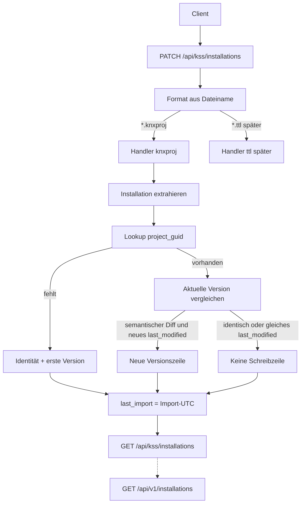

# PATCH Installation exports

Sichtbare Fassung des Ingest-Plans (früher „3API knxproj Import“). Einordnung: [README](README.md).

Vertrag: [KSS and KNX 3rd Party API](kss-and-knx-3rd-party-api.md). Zeit: [Temporale Semantik](temporal-bus-semantics.md). Clients: [HomeAssistant KNX Integration](homeassistant-knx-integration.md).

Großes Ziel: **ein** Export-PATCH speist die gesamte Installation; GET unter `/api/v1` und `/api/kss` liefert denselben Bestand. Weitere Entitäten folgen dem Installations-Muster, damit HA und andere Clients irgendwann nicht mehr lokal parsen.

Orchestrierung: Agent **KSS** → **Modellierer** → **Representer** (Parser-Keys, später TTL/BUS) → **APIler**. Reihenfolge: Installation → Location → Topology → Device → Datapoint → Trade (Function beim Location-Paket). Trade-Quellen und TTL-Split: [Trades](trades.md).

## Status

Installation-GET und `PATCH /api/kss/installations` für `.knxproj` sind umgesetzt. Temporal: `last_modified`-PK, `last_import`, `kss:lastImport`. Fork-`info`-Keys für Installation sind additiv vorhanden. Derselbe PATCH upsertet den globalen knx_master-Snapshot aus `project["master_data"]` und danach **Topology**, **Location + Function**, **Device**, **Channel/Folder/CO**, **Datapoint + GroupRange + `function_datapoints`**, **`comm_object_datapoints`**, **BUS-Indizes**, **Trade + `trade_devices`** (dieselbe Transaktion; Topology vor Location, Location vor Device, Device vor Channel/CO, Channel/CO vor Datapoint, Datapoint vor CO↔GA, CO↔GA vor BUS, BUS vor Trade).

- `src/kss/api/installations.py`
- `src/kss/api/locations.py`, `src/kss/api/functions.py`, `src/kss/api/topology.py`, `src/kss/api/devices.py`, `src/kss/api/datapoints.py`, `src/kss/api/trades.py`, `src/kss/api/channels.py`, `src/kss/api/folders.py`, `src/kss/api/comm_objects.py`
- `src/kss/services/installations.py`, `src/kss/services/locations.py`, `src/kss/services/topology.py`, `src/kss/services/devices.py`, `src/kss/services/device_parts.py`, `src/kss/services/datapoints.py`, `src/kss/services/bus_bindings.py`, `src/kss/services/trades.py`, `src/kss/services/knxproj.py`, `src/kss/services/master.py`
- Fork `devTabSel/xknxproject`

knxproj-Ingest-Pakete bis BUS liegen. TTL-Fill (`mac:assignedTrade`, Tags) und Nutzer-Merge: [Trades](trades.md). 3API-GET-Soll (`links.related`, Nested, Filter) erst wenn Basic-GET für alle Entitäten steht. `.ttl` am PATCH → **501**. OAuth und `/.well-known/knx` später.

| Schnitt | Inhalt | Stand |
| --- | --- | --- |
| fork-kss-profile | ein `parse()`; extra `info`-Keys; `combine`-Default unverändert | vorhanden |
| kss-import-endpoint | `PATCH /api/kss/installations`; 201/204, kein Body | vorhanden (.knxproj) |
| persist-installation | neue Version nur bei Semantik; `last_modified` aus ETS; `last_import` bei jedem PATCH | vorhanden |
| persist-master-catalog | PATCH upsertet knx_master-Snapshot aus `project["master_data"]`; Unique `(knx_id, version)` | vorhanden |
| persist-location-function | derselbe PATCH nach Topology; Unique `(installation_id, ets_id)` `BP-n`/`F-n`; kein Unlink; `default_line_id` wenn Line existiert; `function_datapoints` im Datapoint-Paket | vorhanden |
| persist-topology | derselbe PATCH nach Installation; Unique `(installation_id, ets_id)` `A-n`/`L-n`/`S-n`; Medium als `MT-*`; kein Unlink | vorhanden |
| persist-device | derselbe PATCH nach Location; Unique `(installation_id, ets_id)` `DI-n`; `location_id` aus Space-IA; `segment_id` aus `S-n`; Serial Hex; Sentinel-LastDownload nicht speichern; Channel/Folder/CO im Device-Parts-Schritt | vorhanden |
| persist-device-parts | derselbe PATCH nach Device, vor Datapoint; Unique `(device_id, ets_id)` Channel (`DI-n_CI-n` oder GOT-`RefId`)/Folder `PB-*`/CO `O-…_R-…`; leere Kanäle; nested Channel; Folder XOR Parent; unlinked COs ohne Kante; `last_modified` vom Device; kein Unlink | vorhanden |
| persist-datapoint | derselbe PATCH nach Device-Parts; Unique `(installation_id, ets_id)` `GA-n`/`GR-n`; `at_type` `["knx:FunctionPoint"]`; DPT-Token `datapoint_subtype_ets_id`; `function_datapoints` aus Function-Refs (`GF-n`, `role`); kein Unlink; `comm_object_datapoints` danach | vorhanden |
| persist-comm-object-datapoints | derselbe PATCH nach Datapoint; Kanten aus Device `comm_objects.group_address_ets_ids` (`GA-n`, `linked`); kein Unlink | vorhanden |
| persist-bus | derselbe PATCH nach CO↔GA; `bus_pa_bindings` nur bei `individual_address_loaded` + echtem `last_downloaded`; `bus_ga_bindings` nur bei `communication_part_loaded` + `linked` CO↔GA; Sentinel nie; gleiches PK skip; kein Unlink; kein GET (Index, nicht 3API) | vorhanden |
| persist-trade | derselbe PATCH nach BUS; Unique `(installation_id, ets_id)` `T-n`; Dict-Key = `T-n`; `trade_devices` aus `DeviceInstanceRef` (`DI-n`, `linked`); kein Unlink; kein Device-`assigned_trade` aus knxproj | vorhanden |
| get-installations | `/api/v1` nur 3API; `/api/kss` plus `kss:` | vorhanden |
| get-locations-functions | GET Collection/Item; v1 `title`/`description`/`comment` + `meta.@type`; kss: `etsId`/`locationType`/`usage`/`number`/`completionStatus` bzw. `functionType`; `parentLocation`/`functionLocation` nur als Resource Identifier | vorhanden |
| get-topology | Area/Line/Segment sind **keine** 3API-Ressourcen; Collection/Item nur `/api/kss`; Identifier-Relationen `area`/`line` | vorhanden |
| get-devices | Collection/Item dualer Mount; v1 `lastModified`/`lastDownloaded`/`serialNumber`/`individualAddress`/…; nicht v1-`state`; `deviceLocation` Identifier; kein `deviceDatapoints`; kss: `etsId`/`productRef`/`*Loaded` | vorhanden |
| get-datapoints | Collection/Item dualer Mount; v1 `title`/`description`/`comment`/`readable`/`writable` + `meta.@type`; kein `lastModified`/value/timestamp; kein `datapointFunctions`; kss: `etsId`/`groupAddress`/`datapointSubtype`; GroupRange **keine** 3API-Ressource, nur `/api/kss/group-ranges` | vorhanden |
| get-trades | Trade ist **keine** 3API-Ressource; Collection/Item nur `/api/kss/trades`; `parentTrade` Identifier; kein `tradeDevices` | vorhanden |
| get-device-parts | Channel/Folder/CommObject sind **keine** 3API-Ressourcen; Collection/Item nur `/api/kss/channels`, `/api/kss/folders`, `/api/kss/comm-objects`; Identifier `device`/`parentChannel`/`parentFolder`/`channel`/`folder`; kein `lastModified` | vorhanden |
| tests-research-knxproj | WA53H10; 422 unbekanntes Format / Schema &lt; 23 | vorhanden |
| http-layout | eine Datei je Entität, dualer Mount | vorhanden — [KSS and KNX 3rd Party API](kss-and-knx-3rd-party-api.md) |

## Leitplanken

- **Auth später.** Keine Fake-401, keine Dummy-Tokens.
- **KSS enthält die 3API** als parallelen **URL-Baum**, nicht als parallele `src`-Pakete. Extra-Verben nur unter `/api/kss`.
- **Kein Eigenparser.** Parser ist der Fork `devTabSel/xknxproject`. KSS mappt Parser-Output → Persistenz.
- **Fork additiv.** Ein `parse()`, keine zweite API. KSS ruft `XKNXProj(..., language=…).parse(combine=False)`. `language` ist die Anmeldesprache des PATCH (`Accept-Language`, erster Range), nicht persistiert.
- **Versionieren** nur bei semantischem Diff. `last_modified` ist ETS-Zeitstempel, nicht Datei-`created`. Kanone: [Temporale Semantik](temporal-bus-semantics.md).
- **Datei-Ingest** ist `PATCH /api/kss/installations` (Collection). Kein POST, kein `/import`. Identität in `project_guid`. Formate: `.knxproj` jetzt, TTL später. Anmeldesprache = HTTP `Accept-Language` (nach Login derselbe Header); leer/fehlend → Parser `language=None`. Kein `kss:languageCode`.

## Datenfluss

## Schicht 1: xknxproject (additiv)

`XKNXProj.parse(combine: bool = True)` bleibt der einzige Einstieg.

- `parse()` / `parse(combine=True)`: bisheriges HA-Verhalten (`combine_project`).
- `parse(combine=False)`: rohes ETS — das nutzt KSS. Aufruf: `XKNXProj(path, password=…, language=…).parse(combine=False)`.
- `language` kommt vom PATCH-`Accept-Language` (erster Language-Range, ohne `;q=`). Fehlt/leer → `None` (Manufacturer-/knx_master-Defaulttexte). Parser mappt `de` → `de-DE` über ProductLanguages. Nicht auf Installation speichern.
- Extra `info`-Keys immer füllen (billig). Parser-`info` darf weiter `language_code` enthalten; der Mapper ignoriert ihn.

Bereits in `info`: `project_id`, `name`, `last_modified`, `group_address_style`, `guid`, `created_by`, `schema_version`, `tool_version`, `language_code`.

Neu (Installation): `installation_index`, `ets_id`, `completion_status` (XML-Omit → `Undefined`), `comment`, `master_data_version`, `project_number`, `contract_number`, `project_type` (XML-Token, z. B. `Family House`), `project_start`, `bcu_key`, `ip_routing_backbone_key`. Leer/Omit → NULL, kein Ingest-Fehler. `installation_index` nie persistieren, nie `kss:installationIndex`.

Schema **≥ 23** (ETS 6.4.1+); darunter 422.

**Nicht umschlüsseln:** Locations nach Name, Devices nach IA (bekannte Fork-Lücken).

## Schicht 2: parallele Collections + PATCH

| URL | Verb | Vertrag |
| --- | --- | --- |
| `/api/v1/installations` | GET | 3API Collection, Kategorie-1 |
| `/api/v1/installations/{id}` | GET | 3API Item, Kategorie-1 |
| `/api/v1/installations` | POST/PATCH | **nicht** angeboten |
| `/api/kss/installations` | GET | analog + `kss:` |
| `/api/kss/installations/{id}` | GET | analog Item + `kss:` |
| `/api/kss/installations` | PATCH | Datei-Ingest (Multipart) |

Warum Collection, nicht `PATCH …/{id}`: vor dem ersten Import gibt es keine UUID.

Multipart: `file` Pflicht; optional `filename`, `created` (Datei, nicht ETS-LastModified), `password`. Anmeldesprache nicht als Form-Feld: HTTP `Accept-Language` des PATCH. Erster Range (vor dem Komma, `;q=` abgeschnitten) geht an den Parser. Fehlt/leer → kein 422, `language=None`.

Antwort: kein Body. **201** neu, **204** sonst. Client liest per GET. Fehler JSON:API (422/501/500).

`kss:` u. a. `kss:etsId`, `kss:projectGuid`, `kss:groupAddressStyle`, `kss:masterDataVersion`, `kss:projectType`, `kss:projectStart`, `kss:schemaVersion`, `kss:createdBy`, `kss:toolVersion`, **`kss:lastImport`**. Kein `kss:languageCode`. Kein `kss:installationIndex`. Kein `kss:bcuKey` / `kss:ipRoutingBackboneKey` (persistiert, nicht in GET). Kein `kss:since` / `kss:observableSince`.

## Schicht 3: Persistenz

Identität: `project_guid` unique. Dieselbe Guid aus knxproj und späterem TTL = dieselbe Zeile.

- Neu: Identität + erste Version. 3API-`id` = neue UUID, danach stabil. `last_import` setzen. `project_start` aus info, wenn vorhanden. `language_code` aus Parser-info nicht schreiben.
- Existiert: `id`, `ets_id`, `project_guid` nicht umschreiben. `last_import` immer aktualisieren. `project_start` überschreiben, wenn eingehend nicht null — auch ohne neue Version (noop PATCH). Parser-`language_code` ignorieren. `group_address_style` liegt auf der Version.
- Neue Version nur bei semantischem Diff. PK `(installation_id, last_modified)`. Gleiches `last_modified` → keine zweite Zeile.

Mapping `info` → Installation (Schema 006):

| Quelle | Ziel |
| --- | --- |
| neue UUID nur beim Anlegen | `installations.id` |
| `ets_id`, `guid` | Identität; Reimport schreibt `ets_id` / `project_guid` nicht um |
| `last_import` | Identität; immer PATCH-Uhr |
| PATCH `Accept-Language` (erster Range) | Parser-Input `XKNXProj(..., language=…)`; nicht persistiert; kein Identity-Feld |
| `language_code` (Parser-info) | ignorieren |
| `project_start` | Identität; `parse_ets_datetime`; Reimport überschreibt wenn eingehend nicht null; ungültig → 422 |
| `project_id`, `installation_index` | nicht persistieren (im `ets_id`) |
| `name` | `title` (Version) |
| `comment`, `completion_status`, `project_type`, `master_data_version`, `contract_number`, `project_number`, `schema_version`, `created_by`, `tool_version`, `ip_routing_backbone_key`, `bcu_key`, `group_address_style` | Version |
| `last_modified` | PK-Teil; erzeugt allein keine Version |

Datei-Metadaten fließen nicht in diese Tabellen. Derselbe PATCH upsertet den globalen knx_master-Snapshot aus `project["master_data"]` (`upsert_master_catalog`, vor dem Installation-Upsert, dieselbe Transaktion). Unique `(master_data.knx_id, version)`: existiert der Snapshot, keine Kind-Inserts. Fehlendes `knx_id`/`version` → Katalog überspringen, Installation trotzdem upserten. `MasterProjectType` nicht aus diesem Key. GET `/api/v1/datafields` folgt später.

BUS-Indizes: `bus_pa_bindings` / `bus_ga_bindings` im selben PATCH nach CO↔GA ([Temporale Semantik](temporal-bus-semantics.md)). Kein Collection-GET.

Location + Function (Schema Location-Paket, derselbe PATCH, nach Installation-Upsert):

Identität Unique `(installation_id, ets_id)`. `ets_id` = Parser-`ets_id` oder Suffix von `identifier` nach letztem `_` (`BP-n` / `F-n`). Dict-Key (Name) ist keine Identität. Baumwalk für `parent_location_id`. `prj:Site` wird nicht persistiert.

| Quelle | Ziel |
| --- | --- |
| Space `name` (leer → `ets_id`) | `title` |
| `description`, `comment`, `number` | Version; leer → NULL |
| Space `type` in `LOCATION_TYPE_VALUES` | `location_type`; sonst NULL |
| `usage_id` (`tag:office` / `SU-*`) | `usage`; nie `usage_text` |
| `completion_status` | Version; leer → NULL |
| `["loc:" + location_type]` | `at_type`; Function `["core:ApplicationFunction"]` |
| Space-`last_modified` sonst Installations-`last_modified` | PK-Teil |
| Function `function_type` leer → `FT-0` | `function_type_ets_id` NOT NULL |
| Function `space_id` → Location `ets_id` | `location_id` |

Nicht in diesem Schnitt: `default_line_id` (FK `lines`, Topologie später), `function_datapoints` (braucht Datapoints), Device-Refs an Spaces, Unlink fehlender Orte/Funktionen.

GET `/api/v1` Location/Function **Ist:** `title`, optional `description`/`comment`. Kein `lastModified`/`state`. `meta.@type` aus `at_type`. `relationships.parentLocation` / `functionLocation` nur wenn FK gesetzt (JSON:API Resource Identifier). Keine Kind-/Device-/Function-Listen. `/api/kss` zusätzlich `kss:etsId` und die oben genannten `kss:`-Keys wenn nicht NULL.

GET **Soll** (Nested, `links.related`, Collection-Filter, Node): [KSS and KNX 3rd Party API](kss-and-knx-3rd-party-api.md). Ist ist Übergang.

knxproj-Ingest bis BUS liegt. Nächste Schnitte: TTL-Fill am Device. `default_line_id` am Location-Reimport sobald Lines existieren (liegt).

## Schicht 4: Lesen

Pagination-Defaults nur in `kss/api/deps.py`. Collection-`meta.collection` immer. Item: `data.type`, `data.id`, `attributes.title` Pflicht. Aktuell = `max(last_modified)`. GET-Hülle und Relationships: [KSS and KNX 3rd Party API](kss-and-knx-3rd-party-api.md) (Soll `links.related`; Ist noch Identifier / leere Relationen weglassen).

Spätere Ressourcen ebenfalls URL-Paar `/api/v1/…` + `/api/kss/…`, eine Datei je Entität.

## Tests

Testdaten: **WA53H10** (produktiv, groß, komplex). knxproj `research/WA53H10.knxproj`, TTL `research/WA53H10.ttl`. Erwartung: Name `WA53H10`, `ets_id` `P-040E-0`, Guid `666d92fe-6df1-445e-8c0a-a9be732a8c3f`, `CompletionStatus=Editing`, Schema 23. GET ohne `kss:languageCode`. PATCH `Accept-Language: de-DE,de;q=0.9` → Parser `language="de-DE"`; fehlender Header → `language=None`. Parser-info `language_code` wird beim Mapping ignoriert. Nach 201: `MasterData` `MD-1` Version 285, `DPST-1-1` Text `switch`, `MasterTranslation` de-DE Text `Schalten` für `DPST-1-1`; zweiter PATCH 204 ohne zweite `MasterData`-Zeile.

Analyse-Korpus: **alle** `research/*.knxproj` (XSD) und **alle** `research/*.ttl` (Ontologie). `test_A*` sind Reverse-Engineering-Fälle (Namenskollision, Löschen+Neuanlage, Rename, IDs), nicht Default-Importtest.

## Backlog (danach)

1. TTL-Fill und Nutzer-Merge: [Trades](trades.md) — knxproj füllt `trades`/`trade_devices` (liegt); TTL füllt Device-Name und KIM-Tags, ohne Auto-Join.
2. Fork-Extras: Channel/Folder/unlinked COs liegen (`group_object_tree`, `comm_objects` am Device). `ets_id` an Space/Function/Topology/Device/GA/GR/Trade, GroupRange-`Id`, Segmente, Device `LastDownload`/`*Loaded`, knx_master-Katalog, Trades liegen.
3. Device-Import füllt `bus_pa_bindings` / `bus_ga_bindings` (liegt). Telegramm-Lookup (`telegram_semantics.py`) später.
4. TTL/JSON-LD am selben PATCH (`project_guid`).
5. OAuth2 / `/.well-known/knx`.
6. Optional Import-Protokoll (Dateiname, `created`).
