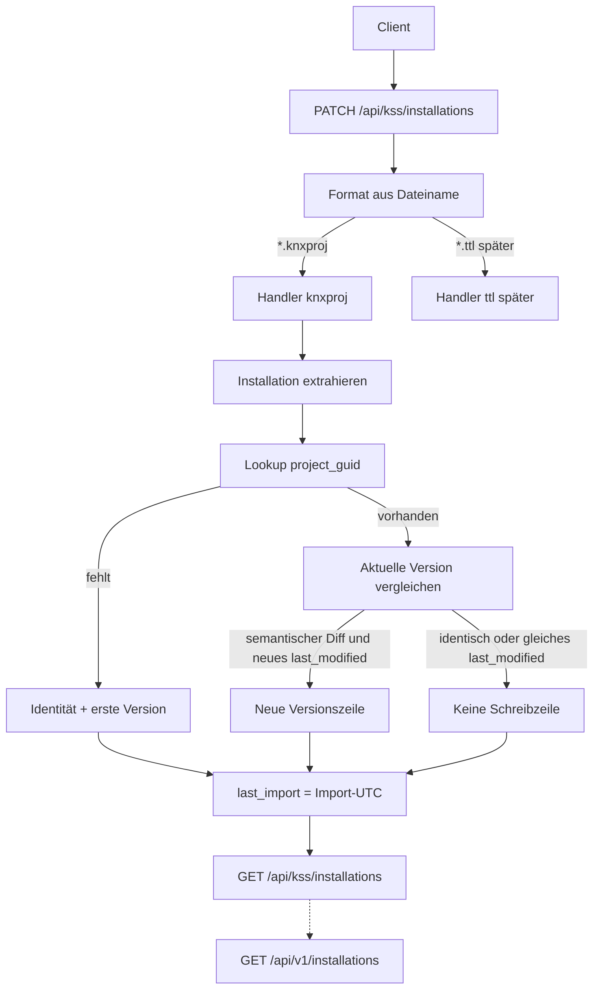

# PATCH Installation exports

Sichtbare Fassung des Ingest-Plans (früher „3API knxproj Import“). Einordnung: [README](README.md).

Vertrag: [KSS and KNX 3rd Party API](kss-and-knx-3rd-party-api.md). Zeit: [Temporale Semantik](temporal-bus-semantics.md). Clients: [HomeAssistant KNX Integration](homeassistant-knx-integration.md).

Großes Ziel: **ein** Export-PATCH speist die gesamte Installation; GET unter `/api/v1` und `/api/kss` liefert denselben Bestand. Weitere Entitäten folgen dem Installations-Muster, damit HA und andere Clients irgendwann nicht mehr lokal parsen.

Orchestrierung: Agent **KSS** → **Modellierer** → **Representer** (Parser-Keys, später TTL/BUS) → **APIler**. Reihenfolge: Installation → Location → Topology → Device → Datapoint → Trade (Function beim Location-Paket).

## Status

Installation-GET und `PATCH /api/kss/installations` für `.knxproj` sind umgesetzt. Temporal: `last_modified`-PK, `last_import`, `kss:lastImport`. Fork-`info`-Keys für Installation sind additiv vorhanden.

- `src/kss/api/installations.py`
- `src/kss/services/installations.py`, `src/kss/services/knxproj.py`
- Fork `devTabSel/xknxproject`

Nächste Entitäten analog. `.ttl` am PATCH → **501**. OAuth und `/.well-known/knx` später.

| Schnitt | Inhalt | Stand |
| --- | --- | --- |
| fork-kss-profile | ein `parse()`; extra `info`-Keys; `combine`-Default unverändert | vorhanden |
| kss-import-endpoint | `PATCH /api/kss/installations`; 201/204, kein Body | vorhanden (.knxproj) |
| persist-installation | neue Version nur bei Semantik; `last_modified` aus ETS; `last_import` bei jedem PATCH | vorhanden |
| get-installations | `/api/v1` nur 3API; `/api/kss` plus `kss:` | vorhanden |
| tests-research-knxproj | WA53H10; 422 unbekanntes Format / Schema &lt; 23 | vorhanden |
| http-layout | eine Datei je Entität, dualer Mount | vorhanden — [KSS and KNX 3rd Party API](kss-and-knx-3rd-party-api.md) |

## Leitplanken

- **Auth später.** Keine Fake-401, keine Dummy-Tokens.
- **KSS enthält die 3API** als parallelen **URL-Baum**, nicht als parallele `src`-Pakete. Extra-Verben nur unter `/api/kss`.
- **Kein Eigenparser.** Parser ist der Fork `devTabSel/xknxproject`. KSS mappt Parser-Output → Persistenz.
- **Fork additiv.** Ein `parse()`, keine zweite API. KSS ruft `parse(combine=False)`.
- **Versionieren** nur bei semantischem Diff. `last_modified` ist ETS-Zeitstempel, nicht Datei-`created`. Kanone: [Temporale Semantik](temporal-bus-semantics.md).
- **Datei-Ingest** ist `PATCH /api/kss/installations` (Collection). Kein POST, kein `/import`. Identität in `project_guid`. Formate: `.knxproj` jetzt, TTL später.

## Datenfluss

## Schicht 1: xknxproject (additiv)

`XKNXProj.parse(combine: bool = True)` bleibt der einzige Einstieg.

- `parse()` / `parse(combine=True)`: bisheriges HA-Verhalten (`combine_project`).
- `parse(combine=False)`: rohes ETS — das nutzt KSS.
- Extra `info`-Keys immer füllen (billig).

Bereits in `info`: `project_id`, `name`, `last_modified`, `group_address_style`, `guid`, `schema_version`, `tool_version`.

Neu (Installation): `installation_index`, `ets_id`, `completion_status` (XML-Omit → `Undefined`), `comment`, `master_data_version`, `project_number`, `contract_number`, `project_type` (XML-Token, z. B. `Family House`).

Schema **≥ 23** (ETS 6.4.1+); darunter 422.

**Nicht umschlüsseln:** Locations nach Name, Devices nach IA (bekannte Fork-Lücken).

## Schicht 2: parallele Collections + PATCH

| URL | Verb | Vertrag |
| --- | --- | --- |
| `/api/v1/installations` | GET | 3API Collection, Kategorie-1 |
| `/api/v1/installations/{id}` | GET | 3API Item, Kategorie-1 |
| `/api/v1/installations` | POST/PATCH | **nicht** angeboten |
| `/api/kss/installations` | GET | analog + `kss:` |
| `/api/kss/installations/{id}` | GET | analog Item + `kss:` |
| `/api/kss/installations` | PATCH | Datei-Ingest (Multipart) |

Warum Collection, nicht `PATCH …/{id}`: vor dem ersten Import gibt es keine UUID.

Multipart: `file` Pflicht; optional `filename`, `created` (Datei, nicht ETS-LastModified), `password`.

Antwort: kein Body. **201** neu, **204** sonst. Client liest per GET. Fehler JSON:API (422/501/500).

`kss:` u. a. `kss:etsId`, `kss:projectGuid`, `kss:installationIndex`, `kss:groupAddressStyle`, `kss:masterDataVersion`, `kss:projectType`, **`kss:lastImport`**. Kein `kss:since` / `kss:observableSince`.

## Schicht 3: Persistenz

Identität: `project_guid` unique. Dieselbe Guid aus knxproj und späterem TTL = dieselbe Zeile.

- Neu: Identität + erste Version. 3API-`id` = neue UUID, danach stabil. `last_import` setzen.
- Existiert: Identität nicht umschreiben (`id`, `project_guid`, `group_address_style` immutable). `last_import` immer aktualisieren.
- Neue Version nur bei semantischem Diff. PK `(installation_id, last_modified)`. Gleiches `last_modified` → keine zweite Zeile.

Mapping `info` → Installation:

| Quelle | Ziel |
| --- | --- |
| neue UUID nur beim Anlegen | `installations.id` |
| `ets_id`, `guid`, `project_id`, `installation_index`, `group_address_style` | Identität |
| `name` | `title` |
| `comment`, `completion_status`, `project_type`, `master_data_version`, `contract_number`, `project_number` | Version |
| `last_modified` | PK-Teil; erzeugt allein keine Version |

Datei-Metadaten fließen nicht in diese Tabellen. Katalog (DPT/Datafields) nicht im ersten Schnitt; beim Device-/Datapoint-Import nachziehen.

BUS-Indizes: erst mit Device-Import ([Temporale Semantik](temporal-bus-semantics.md)).

## Schicht 4: Lesen

Pagination-Defaults nur in `kss/api/deps.py`. Collection-`meta.collection` immer. Item: `data.type`, `data.id`, `attributes.title` Pflicht. `relationships` weglassen, solange leer. Aktuell = `max(last_modified)`.

Spätere Ressourcen ebenfalls URL-Paar `/api/v1/…` + `/api/kss/…`, eine Datei je Entität.

## Tests

Testdaten: **WA53H10**. Erwartung: Name `WA53H10`, `ets_id` `P-040E-0`, Guid `666d92fe-6df1-445e-8c0a-a9be732a8c3f`, `CompletionStatus=Editing`, Schema 23.

test_A bleibt Referenz für Namenskollisionen, nicht Default-Importtest.

## Backlog (danach)

1. Weitere Entitäten in der Paket-Reihenfolge (Modellierer → Representer bei neuen Parser-Keys → APIler → Representer für TTL/BUS).
2. Fork-Extras: `ets_id` an Objekten; GroupRange-`Id`; Segmente; Device `LastDownload`/`*Loaded`; unlinked COs; Trades; knx_master-Katalog.
3. Device-Import füllt `bus_pa_bindings` / `bus_ga_bindings`.
4. TTL/JSON-LD am selben PATCH (`project_guid`).
5. OAuth2 / `/.well-known/knx`.
6. Optional Import-Protokoll (Dateiname, `created`).
